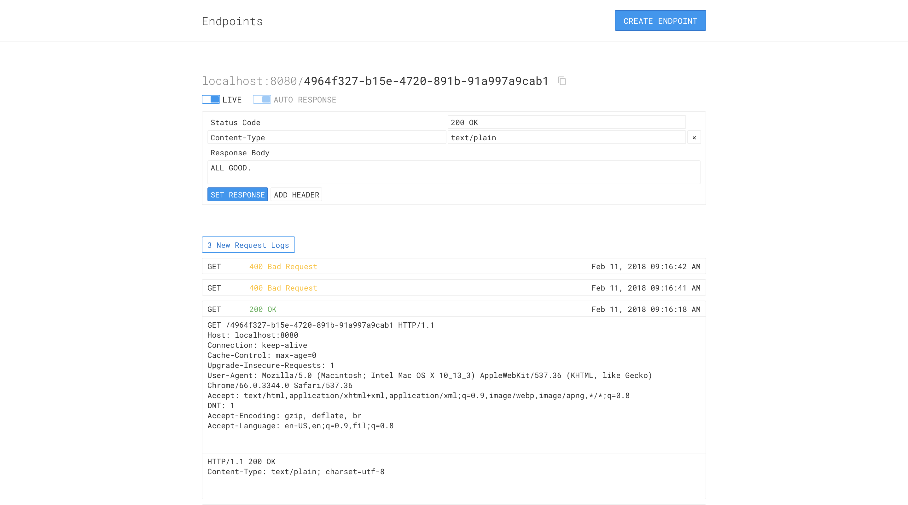

# endpoints

View and send custom responses to requests on HTTP endpoints.




## Running this project

This project requires **Python >=3.5** and **NodeJS >=6.0**. Please make sure to have them installed on your system.

Follow the following steps in order to setup and run this project:

```bash
# Clone the repository
$ git clone https://github.com/uncaughtxcptn/endpoints.git
$ cd endpoints

# Install dependencies
$ pip install -r requirements.txt
$ npm install

# Build frontend assets
$ npm run build
$ npm run build:watch  # You can also auto-compile assets as they change

# For production build of assets, NODE_ENV needs to be specified
$ NODE_ENV=production npm run build

# Install redis
Installation guide can be found [here](https://redis.io/topics/quickstart)

# Install postgresql
Installation guide can be found [here](https://www.digitalocean.com/community/tutorials/how-to-install-and-use-postgresql-on-ubuntu-16-04)


# Add how to run the Python project
Make sure to create a postgres database
$ createdb endpoints
Make sure that redis is running (you need a separate terminal for this)
$ redis-server
Run the Web server
$ cd endpoints/src
$ python main.py


## License

MIT License
